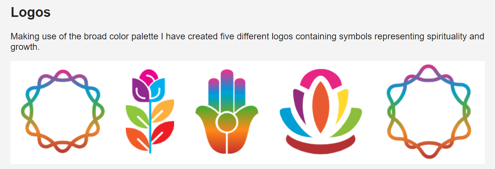

# design_brief_cob
This is a design brief I completed for a new Reiki Healing business in Orange County, California.   
The owner was basically starting from scratch and needed someone that could design some logos for her, create some mockups for business cards, and design and build a WordPress website.  
I created this brief to present my initial work that I did after spending some time learning about her and her business and the message she wants to convey to her clients with her brand.  
The brief is essentially a walkthrough of all of the visual components that go into building an effective online presence as well as some rationale for my decisions.   
One example of this was where I explained the benefits of using an SVG hero image for the sites landing page rather than a bunch of photos.   
After getting all of the designs finished I compiled my work into a web page format using HTML and CSS so that the client could interact with everything herself, as some of the design components included buttons with hover effects, so she could get a true feel for how everything would look when it was finished.  

Here is a preview of the brief: 
  

Through the completion of this project I gained experience doing the following: 
- Designing logos, graphics, UI components, and business cards using Vector Illustration software
- Working with a client and meeting deadlines while producing a satisfactory product
- Collecting feedback and constructive criticism about my work and making appropriate changes as needed
- Presenting a final draft of the designs to a client in the form of a design brief
- Building and publishing a WordPress website for a local business 

The finished brief can be viewed at the following link:  
https://paul-schultz.github.io/design_brief_cob/  
